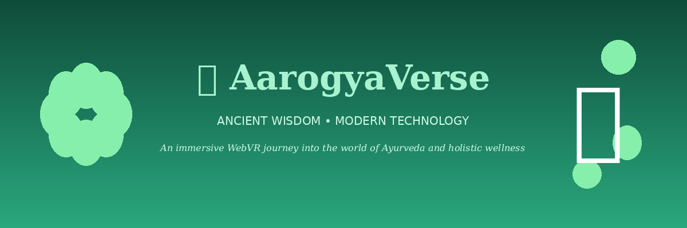
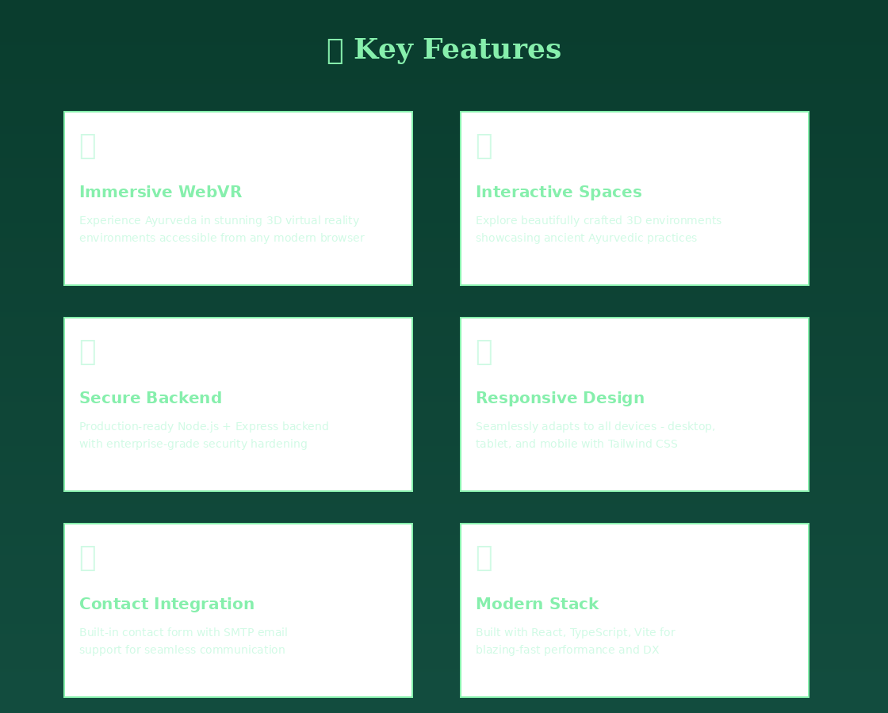

# 🌿 AarogyaVerse



**AarogyaVerse** is an **immersive WebVR platform** that brings **ancient Indian Ayurveda** to life using modern web technologies. Explore interactive 3D environments, learn about wellness practices, and experience a digital journey into holistic health.

🌐 **Live Demo:** [Visit AarogyaVerse](https://arogyaverse.vercel.app)  
📂 **Repository:** [GitHub](#)

---

## 📖 About the Project

AarogyaVerse bridges the gap between ancient Ayurvedic wisdom and cutting-edge web technology. Through virtual reality experiences, users can:

- 🧘‍♀️ Explore immersive 3D environments inspired by Ayurvedic principles
- 🌱 Learn about holistic wellness practices
- 🎯 Experience interactive educational content
- 🌍 Access wellness knowledge from anywhere in the world

This platform makes traditional Ayurveda accessible and engaging for the modern digital audience.

---

## 🛠️ Tech Stack


### Frontend
- ⚡ **React** - Modern UI library for building interactive interfaces
- 📘 **TypeScript** - Type-safe development for robust code
- ⚡ **Vite** - Next-generation frontend tooling for blazing-fast builds
- 🎨 **Tailwind CSS** - Utility-first CSS framework for rapid styling
- 🧩 **Shadcn-UI** - Beautiful, accessible component library
- 🥽 **WebVR** - Immersive 3D virtual reality experiences

### Backend
- 🟢 **Node.js** - JavaScript runtime for scalable server-side applications
- 🚂 **Express** - Fast, minimalist web framework
- 🔒 **Security Hardening** - Production-grade security implementations
- 📧 **SMTP Integration** - Email functionality for contact forms

### Deployment
- ▲ **Vercel** - Optimized hosting with global CDN
- 🌐 **Production Ready** - Configured for high availability

---

## ✨ Features



### 🌐 Immersive WebVR Experience
Experience Ayurveda in stunning 3D virtual reality environments accessible from any modern browser. No special equipment required - just your device and curiosity.

### 🏞️ Interactive 3D Spaces
Explore beautifully crafted 3D environments showcasing ancient Ayurvedic practices and wisdom. Each space is designed to educate and inspire.

### 🔐 Secure Backend
Production-ready Node.js + Express backend with enterprise-grade security hardening. Your data and interactions are protected.

### 📱 Fully Responsive Design
Seamlessly adapts to all devices - desktop, tablet, and mobile. Experience AarogyaVerse wherever you are with Tailwind CSS responsive design.

### 📧 Contact Integration
Built-in contact form with SMTP email support for seamless communication. Reach out with questions or feedback easily.

### ⚡ Modern Development Stack
Built with React, TypeScript, and Vite for blazing-fast performance and exceptional developer experience.

---

## 🚀 Getting Started

### Prerequisites
- Node.js 18+ installed on your system
- npm or yarn package manager

### Installation

1. **Clone the repository**
   ```bash
   git clone https://github.com/gagandeepsingh76/Arogyaverse.git
   cd Arogyaverse
   ```

2. **Install dependencies**
   ```bash
   npm install
   ```

3. **Environment Setup**
   Create a `.env` file in the root directory with necessary configurations:
   ```env
   # Add your environment variables here
   VITE_API_URL=your_api_url
   SMTP_HOST=your_smtp_host
   SMTP_PORT=your_smtp_port
   SMTP_USER=your_email
   SMTP_PASS=your_password
   ```

---

## 💻 Development

### Frontend Development
Run the development server for the frontend:

```bash
npm run dev
```

The application will be available at `http://localhost:5173` (or another port if 5173 is in use).

### Backend Development
To run the backend server:

```bash
npm start
```

The backend API will be available at `http://localhost:3000` (or your configured port).

### Build for Production

```bash
# Build the frontend
npm run build

# Preview the production build
npm run preview
```

---

## 📦 Deployment

### Single Server Deployment

1. **Build the frontend**
   ```bash
   npm run build
   ```

2. **Start the backend**
   ```bash
   npm start
   ```

3. **Configure your server** to serve the built files from the `dist` directory

### Vercel Deployment

The project is optimized for Vercel deployment:

1. Push your code to GitHub
2. Import the repository in Vercel
3. Configure environment variables
4. Deploy!

Current live deployment: [https://arogyaverse.vercel.app](https://arogyaverse.vercel.app)

---

## 📁 Project Structure

```
AarogyaVerse/
├── src/                  # Frontend source code
│   ├── components/       # React components
│   ├── pages/           # Page components
│   ├── assets/          # Images, fonts, etc.
│   └── styles/          # CSS and styling files
├── server/              # Backend source code
│   ├── routes/          # API routes
│   ├── controllers/     # Route controllers
│   └── middleware/      # Express middleware
├── public/              # Static files
├── dist/                # Production build output
└── package.json         # Dependencies and scripts
```

---

## 🤝 Contributing

Contributions are welcome! Here's how you can help:

1. **Fork the repository**
2. **Create a feature branch**
   ```bash
   git checkout -b feature/AmazingFeature
   ```
3. **Commit your changes**
   ```bash
   git commit -m 'Add some AmazingFeature'
   ```
4. **Push to the branch**
   ```bash
   git push origin feature/AmazingFeature
   ```
5. **Open a Pull Request**

Please ensure your code follows the existing style and includes appropriate tests.

---

## 🐛 Bug Reports & Feature Requests

Found a bug or have a feature request? Please open an issue on GitHub with:
- A clear description
- Steps to reproduce (for bugs)
- Expected vs actual behavior
- Screenshots if applicable

---

## 👤 Creator

- 💼 **Created by**: Kshama Mishra

---

<div align="center">


Created by Kshama Mishra

</div>
